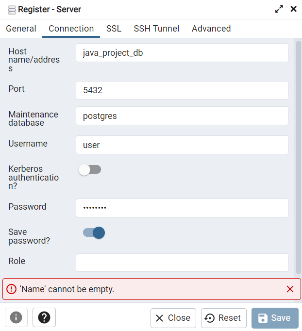
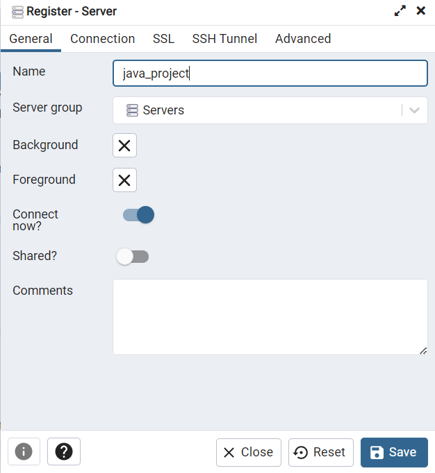
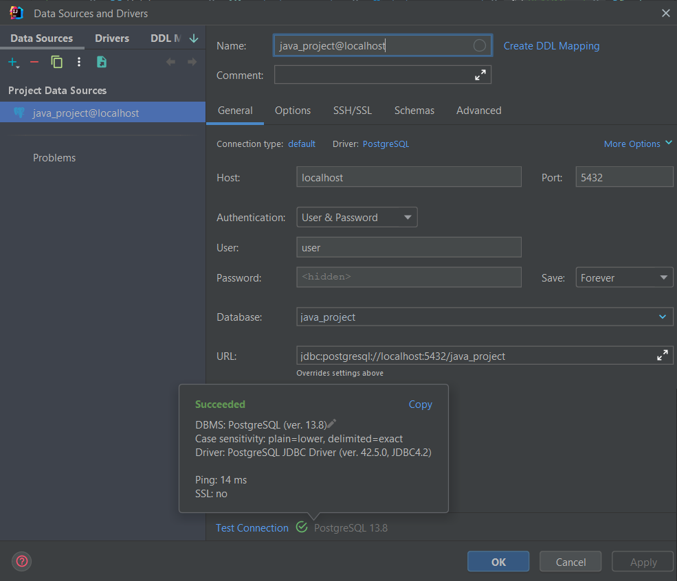

# Java Project Bilgi Tuncay

## Résumé :
Le but est de créer une base de données où l'on peut mettre des séries.
Elle permet de tenir un compte de toutes les séries que l'on à vu, commencées ou que l'on souhaite voir, ce qui est pratique quand on se demande 3 ans après avoir commencé Breaking Bad "Ah mince à quel épisode j'étais déjà ?".

## Prérequis :

- Java SEE
- Docker
- Les ports 8080,5050,5432 libres (peut être modifier dans le docker-compose.yml)
- La gestion des dépendances ce fait avec gradle.
- Les requêtes sont envoyées avec insomnia. Si vous utilisez ce genre d'outil, le dossier `./html_requests` contient des exports de mes requêtes insomnia sous deu formats différents.

## Démarrage :
L'application marche avec une base donnée PostgreSQL qui est initialisée dans un container Docker. On utilise aussi Docker pour instancié Pgadmin qui est pratique pour voir la BDD. 
Il faut donc :

- lancer le container en tache de fond (pour pas encombrer le terminale) :

    
    // Dans centrale.3a.spring/
    docker compose up -d

- Se connecter sur Pgadmin si besoin :
    
    Aller sur localhost:5050 pour accéder à la page.
    Les identifiants de connections sont :
    `email : user@email.com`

    `mot de passe : password`
    Ils peuvent être modifié dans le docker-compose si l'envie vous en prends.

- Entrer le serveur sur Pgadmin :
    Pour relier la DB au dashboard, il faut les connectés avec les identifiants suivants :
 
  

- Il faut aussi peut-être relier la DB à IJ :

- Vous pouvez lancer RestApplication et tout devrait fonctionner.

## Endpoints :

Obtenir toutes les séries :

    - Get : http://127.0.0.1:8080/project/series

Obtenir la wishlist (toutes les séries "wished") : 

    - Get : http://127.0.0.1:8080/project/wishlist

Obtenir les séries qui sont plus courtes que lenght :

    - Get : http://127.0.0.1:8080/project/shorter/50

Ajouter une série avec toutes les infos nécessaires (/!\ Il n'y a aucune vérification que les infos sont cohérentes) :

    - Post : http://127.0.0.1:8080/project/series
    - Exemple de body :
	{
		"name": "GravityFalls",
		"state": "Started",
		"episode": 26,
		"totalEpisode": 46
	}

Supprimer une série avec son id :

    - DELETE : http://127.0.0.1:8080/project/delete/2

Modifier une série avec son id :

    - PUT : http://127.0.0.1:8080/project/update/4
    - Exemple de body : 
        	{
		"name": "Gravity Falls",
		"state": "Started",
		"episode": 45,
		"totalEpisode": 46
	    }

## Fonctionnement : 

### Générale : 
La classe Series contient toutes les informations relatives à une série que l'on peut regarder.
On instancie une série puis on la modifie au besoin avec les méthodes associées.
Une fois la préparation terminée, on crée une entité basée sur cette instance. C'est cette entité qui va faire fois dans la base de données. Je ne sais pas si j'avais vraiment besoin de séparer ma classe "fonctionnelle" avec ma classe qui sert d'entité mais ce qui est fait est fait.

Une série possède 4 informations :

- un Id dans la base de données
- un nom (peut être différent du nom de l'instance dans le programme)
- un nombre d'épisodes totaux
- un nombre d'épisodes regardés
- un état

Ces états sont :

- Exist : la série est juste présente dans la base
- Started : la série est commencée, son nombre d'épisodes regardés est potentiellement plus grand que 0.
- Finished : la série est terminée, le nombre d'épisodes est forcément égale au nombre d'épisodes totaux.
- Wished : elle est dans la wishlist, elle n'est pas encore commencée, c'est une série que l'on veut voir dans le futur.
- Dropped : elle à été abandonnée après ou sans avoir été commencée, c'est une série que l'on ne veut pas voir.

### Les Etats :

Les états fonctionnent comme une machine à état. Encore un fois, je ne sais pas à quel point c'"tait nécéssaire mais je voulais refaire le design pattern State.
Ainsi, on à une interface State qui implémente des méthodes et la classe Série possède un State.
Ce state est ensuite instancié par un etat qui implémente State et qui utilise du pokymorphisme pour que par exemple, on ne puisse pas regarder une série qui à été abandonnée.

### Rest appliction :

Permet de drop la BDD puis de créer 3 séries avec des états différents puis de les sauvegarder.

### Arborescence
La branche git a été utilisé pendant plusieurs séance, elle contient donc plus que le projet.
Ainsi on peut retrouver un domain et des controllers qui ne servent pas au projet mais plutôt au code implémenter pendant le cours. Il est fonctionnel (normalement).
Les fichiers et répertoires qui sont importants pour le project sont :

 - ./com.centrale.rest/controller/ProjectDbController
 - ./com.centrale.rest/projectDomain
 - ./com.centrale.rest/entity/SeriesEntity
 - ./com.centrale.rest/repository/SeriesRepository
 - ./com.centrale.rest/resources
 - ./docker-composer.yml

### ./projectDomain

Contient les classes qui pilotent le fonctionnement des séries.
La classe Main permet de tester le fonctionnement des classes sans aller dans la base de données.

#### oups

J'aurais pu essayer d'utiliser ma classe Series dans les endpoints pour faire de la vérification de formats (par exemple empêcher qu'une personne rentre une série où il y a plus d'épisodes regardés que d'épisodes) mais je n'ai pas eu le courage de prendre plus de temps pour le faire.
Finalement, dans l'état, ma classe Series et les States associés ne servent pas à grand-chose.
J'ai nommé ma classe Finnished au lieu de Finished.

